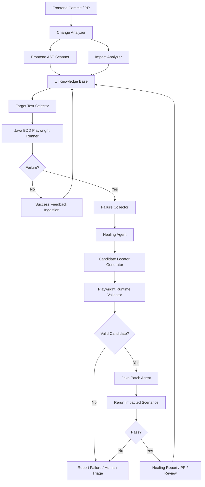
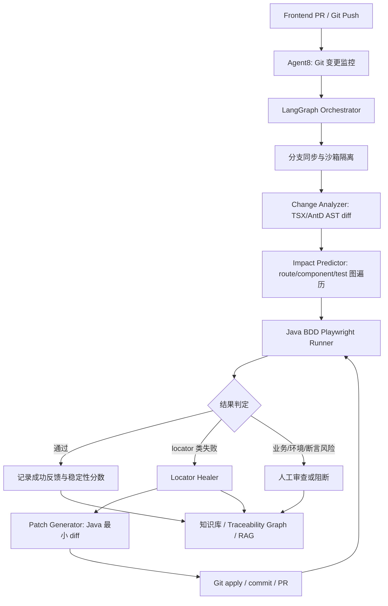

# Java + BDD + Playwright UI 自愈测试架构方案

## 1. 结论

推荐采用“规则引擎 + Playwright 运行验证 + 知识库 + LLM agent”的混合架构。不要把自愈完全交给大模型，也不要只做 Healenium 式传统相似度匹配。

核心原则：

- LLM 负责理解意图、分析变更、生成候选 locator 和代码补丁。
- Playwright 负责真实浏览器验证，决定候选 locator 是否可用。
- 知识库负责长期记忆，沉淀元素、用例、失败和修复历史。
- CI 负责触发、隔离、重跑和准入。
- 人类负责审批高风险修复和新测试生成结果。

这套方案适合你当前的资源：React 18 + Ant Design 5 + Axios 前端代码、Java + BDD + Playwright 历史脚本、失败堆栈、截图、需求描述，以及可安全使用 GPT-5.2、GPT-4o 等模型。

## 2. 开源项目调研结论

调研时间：2026-04-27。

严格意义上“开源、专做 UI locator 自愈、且 GitHub star 超过 1000”的项目不足 10 个。Healenium 是最接近传统自愈架构的项目，但 `healenium-web` 当前约 198 stars，未达到 1000 stars。因此下面分成两类：一类是直接相关但 star 不足，另一类是超过 1000 stars 且对自愈架构有参考价值的项目。

### 2.1 直接相关项目

| 项目 | Stars | 相关性 | 可借鉴点 |
| --- | ---: | --- | --- |
| [healenium/healenium-web](https://github.com/healenium/healenium-web) | 198 | 直接自愈 | `SelfHealingDriver` 包装 Selenium driver；失败后根据历史元素信息和相似度找替代 locator；支持 score-cap、recovery-tries、healing 开关；可作为架构思想参考 |
| [test-zeus-ai/testzeus-hercules](https://github.com/test-zeus-ai/testzeus-hercules) | 987 | AI 测试 agent | 接近 1000 stars；以 agent 方式做 UI/API/可访问性/视觉验证；可参考 agent 化测试执行，但不应直接等同 Java+Bdd 自愈 |

### 2.2 超过 1000 stars 的相关生态项目

| 项目 | Stars | 类型 | 对本方案的启发 |
| --- | ---: | --- | --- |
| [browser-use/browser-use](https://github.com/browser-use/browser-use) | 90,582 | Python AI 浏览器 agent | 证明 Python + LLM + 浏览器状态感知适合做 agent 编排；可借鉴任务规划、浏览器状态抽象 |
| [microsoft/playwright](https://github.com/microsoft/playwright) | 87,408 | Web 自动化框架 | 本方案的执行底座；官方推荐优先使用面向用户的 locator 和 test id |
| [microsoft/playwright-mcp](https://github.com/microsoft/playwright-mcp) | 31,478 | Playwright MCP 工具层 | 使用 accessibility tree 而不是纯截图，适合给 LLM 提供结构化页面上下文；可作为自愈 agent 的页面观察和 locator 生成工具 |
| [lightpanda-io/browser](https://github.com/lightpanda-io/browser) | 29,461 | 面向 AI/自动化的 headless browser | 适合大规模采集和爬取思路参考，但不是 Playwright Java 自愈的直接方案 |
| [apify/crawlee](https://github.com/apify/crawlee) | 22,976 | Playwright/Puppeteer 爬取框架 | 可借鉴队列、重试、会话、并发采集机制，用于批量页面快照和知识库更新 |
| [browserbase/stagehand](https://github.com/browserbase/stagehand) | 22,358 | Browser agent SDK | 强调“代码确定性 + 自然语言弹性”的混合模式；自愈和缓存设计值得参考 |
| [Skyvern-AI/skyvern](https://github.com/Skyvern-AI/skyvern) | 21,396 | AI 浏览器工作流自动化 | 可借鉴视觉/DOM/LLM 混合决策和工作流执行，但不建议直接替代测试框架 |
| [web-infra-dev/midscene](https://github.com/web-infra-dev/midscene) | 12,820 | 视觉驱动 UI 自动化 | 通过视觉语言模型定位和操作 UI，减少对 DOM locator 的依赖；适合作为视觉兜底和新用例探索能力 |
| [seleniumbase/SeleniumBase](https://github.com/seleniumbase/SeleniumBase) | 12,651 | 浏览器自动化测试框架 | 可借鉴稳定性工程、等待、报告和封装方式；不是 locator 自愈专用项目 |
| [nanobrowser/nanobrowser](https://github.com/nanobrowser/nanobrowser) | 12,788 | AI Chrome automation | 可借鉴多 agent 浏览器自动化思路，适合研究 agent 如何分解网页任务 |
| [codeceptjs/CodeceptJS](https://github.com/codeceptjs/CodeceptJS) | 4,220 | 高层 E2E DSL | 可借鉴 actor 风格、BDD 可读性和 locator 抽象；对 Java BDD 设计有参考价值 |
| [getgauge/taiko](https://github.com/getgauge/taiko) | 3,666 | Smart selector 测试库 | smart selectors 会适应页面结构变化，强调少用 id/css/xpath；对自愈 locator 优先级有直接启发 |
| [robotframework/SeleniumLibrary](https://github.com/robotframework/SeleniumLibrary) | 1,467 | Web 测试库 | 可借鉴关键字驱动和业务可读测试资产管理 |

调研判断：

- 真正成熟的开源 locator 自愈框架并不多，传统方案主要是 Healenium 这一类“历史 DOM + 相似度 + 替代 locator”。
- 新一代 AI 项目更多在做“浏览器 agent”或“视觉驱动自动化”，不一定以测试稳定性、审计、Java BDD 代码修复为核心。
- 企业级方案应该吸收 Healenium 的历史元素记忆思想、Midscene 的视觉兜底思想、Stagehand 的代码与自然语言混合思想、Playwright MCP 的结构化页面观察能力。

## 3. Playwright 官方 AI Agents 能力评估

Playwright 官方文档已经提供 Playwright Test Agents，包含 `planner`、`generator`、`healer` 三类 agent。

官方能力：

- `planner`：探索应用并生成 Markdown 测试计划。
- `generator`：把 Markdown 测试计划转成 Playwright Test 文件。
- `healer`：执行测试套件并自动修复失败测试。
- `healer` 失败后会重放失败步骤、检查当前 UI、定位等价元素或流程、建议补丁，例如 locator 更新、等待调整、数据修复，并重跑直到通过或 guardrail 停止。
- agent definitions 底层是指令集合和 MCP tools。

能解决的部分：

- 对 Playwright Test 项目，尤其 TypeScript/JavaScript 项目，可以较好覆盖“测试失败后自动尝试修复 locator 并重跑”的闭环。
- 对新用例生成，`planner + generator` 提供了官方流程样板。
- 对页面观察，Playwright MCP 提供 accessibility snapshot、截图、生成 locator、验证元素可见等工具，这非常适合给 LLM 做结构化上下文。

不能直接解决的部分：

- 你的目标技术栈是 Java + BDD + Playwright，而官方 Test Agents 主要面向 Playwright Test 工程结构，不会直接修改 Java Cucumber step definition、Page Object 或企业内部封装。
- 官方 healer 更像“当前失败测试的自动修补”，不是完整的企业知识库，不包含长期元素画像、commit 影响分析、故事卡知识沉淀、跨项目测试资产治理。
- 它不能天然理解 React 18 + AntD 组件源码和企业业务域之间的关系。
- 它不能默认满足金融场景的审批、审计、脱敏、回滚、分级准入要求。
- 对断言失败、业务流变化、权限变化、接口数据变化，需要额外的根因分类，不能都当 locator 自愈。

建议用法：

- 不建议直接把官方 Playwright Test Agents 当成完整方案。
- 建议复用其架构思想和 Playwright MCP 工具能力。
- 在 Python + LangGraph 中实现自己的 `impact_agent`、`healing_agent`、`patch_agent`、`review_agent`。
- 对页面观察和 locator 生成，可以优先接入 Playwright MCP 或自己用 Playwright Python/Java 实现等价工具。
- 对代码修复，必须自研 Java AST patcher 或 JavaParser/tree-sitter 代码修改模块。

参考链接：

- [Playwright Test Agents](https://playwright.dev/docs/test-agents)
- [Playwright MCP](https://github.com/microsoft/playwright-mcp)
- [Playwright Locators](https://playwright.dev/docs/locators)

## 4. 总体架构



## 5. Agent 划分

### 5.1 Change Analyzer

职责：

- 读取前端 commit diff。
- 判断变更类型：文案、props、组件结构、路由、表单字段、按钮、表格列、弹窗、权限。
- 识别 React 组件和 AntD 组件影响范围。
- 输出受影响页面、元素和测试场景候选。

### 5.2 Impact Analyzer

职责：

- 结合知识图谱，把前端变更映射到历史 BDD 场景。
- 对 locator 风险打分。
- 选择最小回归测试集。

示例输出：

```json
{
  "commit": "abc123",
  "impacted_pages": ["trade-search"],
  "impacted_elements": ["trade.search.form.counterparty.input"],
  "impacted_scenarios": ["Search trade by counterparty"],
  "risk": "high",
  "reason": "Form.Item label and Input placeholder changed; historical locator used getByPlaceholder"
}
```

### 5.3 Failure Collector

职责：

- 解析 Java BDD 执行日志。
- 读取 Playwright trace、截图、DOM、堆栈。
- 识别失败类型。
- 将失败 step、旧 locator、页面上下文标准化。

失败类型建议：

- `LOCATOR_NOT_FOUND`
- `LOCATOR_NOT_UNIQUE`
- `ELEMENT_NOT_VISIBLE`
- `ELEMENT_NOT_ENABLED`
- `ELEMENT_OBSCURED`
- `ASSERTION_TEXT_CHANGED`
- `FLOW_CHANGED`
- `DATA_OR_ENV_FAILURE`
- `NETWORK_OR_BACKEND_FAILURE`

只有前五类优先进入 locator 自愈。

### 5.4 Healing Agent

职责：

- 从知识库召回目标元素历史画像。
- 对比旧页面和新页面。
- 生成候选 locator。
- 给出修复原因和风险。

候选生成策略：

1. 从当前页面 a11y tree 中找 role/name 相近元素。
2. 从 DOM 中找 `data-testid`、label、placeholder、name、title。
3. 从 React diff 中找变更前后的字段映射。
4. 从截图或元素 crop 中找视觉位置相近元素。
5. 使用历史成功 locator 作为参考，但不盲目复用。

### 5.5 Runtime Validator

职责：

- 启动真实浏览器。
- 在失败页面状态下逐个验证候选 locator。
- 判断唯一性、可见性、可点击性、可输入性。
- 试执行当前 action。
- 对通过候选打分。

这是自愈成败的硬门槛。

### 5.6 Java Patch Agent

职责：

- 修改 Java Playwright 代码或 locator 常量。
- 保留原有代码风格。
- 尽量只改 locator，不改业务流程。
- 生成 diff 和说明。

建议优先通过 AST 修改，不建议纯文本替换。

### 5.7 Review Agent

职责：

- 生成自愈报告。
- 标注风险、证据和重跑结果。
- 决定是否自动开 PR、是否需要人工审批。

## 6. CI/CD 集成流程

### 6.1 PR 阶段

```text
前端 PR 创建或更新
  -> 扫描 diff
  -> 更新临时知识库索引
  -> 影响分析
  -> 运行受影响测试
  -> 如果 locator 失败，尝试自愈
  -> 生成修复 PR 或 PR comment
```

### 6.2 主干阶段

```text
merge 到主干
  -> 全量或分层回归
  -> 成功结果回流知识库
  -> 失败结果进入自愈或缺陷分类
  -> 生成趋势报告
```

### 6.3 夜间任务

```text
夜间批处理
  -> 爬取关键页面快照
  -> 检查元素知识库漂移
  -> 评估脆弱 locator
  -> 推荐加 data-testid 或改用 role locator
```

## 7. Java + BDD + Playwright 落地建议

### 7.1 测试代码规范

建议逐步把 locator 从 step definition 中剥离到 Page Object 或 locator registry。

不推荐：

```java
@When("user clicks login")
public void clickLogin() {
    page.locator("#loginBtn").click();
}
```

推荐：

```java
public class LoginPage {
    private final Page page;

    public Locator loginButton() {
        return page.getByRole(
            AriaRole.BUTTON,
            new Page.GetByRoleOptions().setName("Login")
        );
    }
}
```

进一步推荐加元素语义注解，方便知识库扫描：

```java
@UiElement(
    uid = "login.form.submit.button",
    intent = "提交登录表单",
    page = "login"
)
public Locator loginButton() {
    return page.getByRole(
        AriaRole.BUTTON,
        new Page.GetByRoleOptions().setName("Login")
    );
}
```

### 7.2 前端协作规范

对于核心业务元素，需要建立测试契约：

```tsx
<Button data-testid="login-submit-button">
  Login
</Button>
```

规则：

- 核心业务按钮、输入框、表格列、弹窗确认按钮必须有稳定 `data-testid`。
- `data-testid` 由业务语义命名，不使用样式、布局和序号。
- 文案可以国际化变化，但 `data-testid` 应保持稳定。
- 如果重命名 `data-testid`，PR 需要自动触发影响分析。

## 8. 技术选型

### 8.1 推荐主技术栈

| 层 | 推荐 |
| --- | --- |
| Agent 编排 | Python + LangGraph |
| 多 agent 协作 | LangGraph 为主，AutoGen 可用于实验性多角色讨论 |
| LLM | GPT-5.2 负责推理、代码修复、复杂分析 |
| 视觉模型 | GPT-4o 或内部可用视觉模型负责截图理解 |
| 浏览器执行 | Java Playwright 作为正式测试执行；Python Playwright 或 Playwright MCP 作为 agent 采集与验证 |
| Java 解析 | JavaParser 或 tree-sitter-java |
| React 解析 | tree-sitter-typescript、Babel parser 或 ts-morph |
| 数据库 | PostgreSQL |
| 图谱 | Neo4j 或 PostgreSQL AGE |
| 向量库 | Qdrant、OpenSearch Vector 或内部向量平台 |
| 对象存储 | 企业 S3 兼容存储 |
| 报告 | Allure + 自愈报告 Markdown/HTML |
| CI | Jenkins、GitLab CI 或 GitHub Actions |

### 8.2 为什么不直接用 Midscene 替代 locator

Midscene 的视觉路线适合探索、新用例生成和视觉兜底，但企业测试回归不能完全依赖“看图操作”：

- 成本和耗时更高。
- 结果更难审计。
- 对金融系统中的权限、数据、弹窗、表格复杂状态需要更强确定性。
- 修复代码时仍需要落回稳定 locator。

建议使用方式：

- 作为失败自愈的视觉证据源。
- 作为没有稳定 DOM 语义时的兜底定位能力。
- 作为新页面探索和测试计划生成辅助。

### 8.3 为什么不直接套 Healenium

Healenium 是 Selenium 体系，当前目标是 Java + Playwright。更重要的是，Healenium 主要基于历史元素相似度，而你的场景需要：

- 前端 commit 影响分析。
- React + AntD 源码理解。
- BDD 场景和业务意图理解。
- 新故事卡测试生成。
- 企业审计和审批。

因此建议借鉴其“历史元素画像 + 替代 locator + score-cap + 自愈报告”的思想，但实现上用 LLM 和 Playwright runtime validator 替代传统算法。

## 9. 风险与应对

| 风险 | 表现 | 应对策略 |
| --- | --- | --- |
| LLM 幻觉 | 生成不存在或不稳定 locator | 所有候选必须经过 Playwright 验证；LLM 不直接改主分支 |
| 误把功能变更当 locator 失效 | 页面流程确实变了，但 agent 试图强行修复 | 先做失败分类；`FLOW_CHANGED` 和断言语义变化进入人工 triage |
| 知识库污染 | 错误自愈被记录为成功经验 | 记录重跑证据；低置信度不入主知识库；支持回滚 |
| 数据泄露 | 截图、DOM、trace 含客户或内部数据 | 脱敏、最小化上下文、模型调用审计、对象存储权限隔离 |
| 代码补丁破坏风格 | 自动修改 Java 代码引入维护问题 | 使用 AST patch；只改 locator；强制 code review |
| 前端缺少测试契约 | 很多元素只能用脆弱 CSS/XPath | 推动 data-testid 规范；自愈报告反向给前端 PR comment |
| 执行成本过高 | 每次提交都跑大量 UI 测试和 LLM | 先做影响分析；分层回归；缓存页面快照；只对失败调用大模型 |
| AntD DOM 结构复杂 | 组件包装层多，DOM 不稳定 | 优先使用 role、label、testId；建立 AntD 组件语义解析规则 |
| 国际化文案变化 | role/name 或 text locator 失效 | 多语言文本映射；核心元素使用 testId；知识库存 locale |
| 环境和数据不稳定 | 自愈误判 | 接入 API 健康检查、测试数据准备状态、网络日志分类 |

## 10. 分阶段路线图

### Phase 1: Locator 自愈 MVP

- 扫描 Java BDD locator。
- 扫描前端关键页面。
- 运行失败后生成候选 locator。
- Playwright 验证候选。
- 生成修复 diff。
- 人工 review 合并。

### Phase 2: Commit 影响分析

- React + AntD AST 扫描。
- commit diff 到页面/元素/场景映射。
- 最小回归测试选择。
- PR comment 输出 locator 风险。

### Phase 3: 知识库闭环

- 成功和失败执行结果都回流。
- 建立元素稳定性评分。
- 自动推荐前端补充 `data-testid`。
- 形成项目级 UI 元素地图。

### Phase 4: 新故事卡自动生成

- 故事卡和验收标准入库。
- 新页面探索。
- 召回相似历史场景。
- 生成 BDD feature 和 Java step。
- 人工微调后执行并入库。

### Phase 5: 企业级治理

- 权限、审计、脱敏、审批工作流。
- 多项目共享知识库。
- 组织级测试资产复用。
- 自愈成功率、误修复率、节省工时度量。

## 11. 成功指标

建议用以下指标衡量价值：

- locator 类失败自动修复成功率。
- 自愈后重跑通过率。
- 自动修复 PR 被人工接受率。
- 误修复率。
- 平均修复耗时降低比例。
- 受前端提交影响的测试筛选准确率。
- 新故事卡测试生成后人工修改比例。
- 脆弱 locator 数量下降趋势。

## 12. 结合 UI-Root 流程图后的完善架构

`UI-Root.html` 把方案拆成了更清晰的六层链路：触发层、决策层、自愈层、执行层、记录层和知识库。这比单纯的 Agent 划分更适合作为工程落地边界，因为每一层都有明确输入、输出和质量门禁。

### 12.1 六层职责边界

| 层级 | 核心节点 | 职责 | 关键产物 |
| --- | --- | --- | --- |
| 触发层 | Webhook、项目初始化关联、自愈流程触发 | 接收 Git Push/Merge/PR 事件，建立前端工程与自动化工程的初始映射 | PR diff、route/test 影响候选、项目基线映射 |
| 决策层 | LangGraph Orchestrator、分支同步管理器 | 控制状态机流转、沙箱分支创建、质量门禁和人工审批节点 | workflow state、auto-heal-branch、policy decision |
| 自愈层 | Change Analyzer、Impact Predictor、Locator Healer、Patch Generator | 分析 React/AntD 变更、预测影响范围、生成定位器候选和 Java 补丁 | component_graph、locator_catalog、patch.diff |
| 执行层 | Git 管理、Playwright Runner、人工合并、结果路由 | 应用补丁、执行 Java BDD Playwright、重跑验证、按结果分流 | test report、trace/video、rerun result |
| 记录层 | 自愈运行标记表、修复记录数据库 | 保存每次运行状态、证据、成本、修复过程和审批结果 | healing_run、failure_diagnosis、review_decision |
| 知识库 | Traceability Graph + RAG | 沉淀跨项目可复用的页面、元素、用例、失败和修复经验 | route_map、test_plan、historical cases |

### 12.2 推荐端到端闭环



### 12.3 关键设计补充

1. `Agent8` 应作为 PR 级入口，而不是测试失败后才启动。它负责把文件路径、diff 类型、历史映射和风险规则转成可执行的测试选择建议。
2. LangGraph 不只是 Agent 编排工具，还要承担 checkpoint、重试、分支状态、人工审批状态和回滚状态的持久化。
3. 分支同步管理器必须默认创建 `auto-heal-branch-{trace_id}` 沙箱分支。AI 生成的 TSX 注入补丁和 Java 修复补丁都不能直接污染主干。
4. 自愈分级需要固化为准入规则：L1 定位器、testid、等待策略可自动 PR；L2 业务预期、断言语义必须人工审查；L3 环境、代理、后端不可达应阻断并输出证据。
5. 执行层的 Playwright Runner 是硬门禁。LLM 只生成候选，候选必须经过唯一性、可见性、可交互性和重跑验证。
6. 记录层要同时记录成功和失败。成功样本用于提升 locator 稳定分，失败样本用于 RAG few-shot 和风险模型校准。

### 12.4 Agent 与 UI-Root 节点映射

| UI-Root 节点 | 建议 Agent/模块 | 落地说明 |
| --- | --- | --- |
| 前端代码提交 Webhook | `git_change_monitor` | 拉取 PR diff，按 `src/pages/**`、`components/layouts`、`api/store/hooks` 等规则做初筛 |
| 关联初始前端和自动化项目 | `baseline_importer` | 建立 `test -> POM -> locator -> testid -> component -> route` 初始链路 |
| Orchestrator | `workflow_graph` | LangGraph StateGraph，接入 PostgreSQL checkpoint |
| 分支同步管理器 | `git_adapter` | 创建隔离分支，支持 commit、push、rollback 和自动 PR |
| Change Analyzer | `frontend_ast_scanner` | Babel/ts-morph 解析 React 18 + AntD 5，输出 `component_graph.static.json` |
| Impact Predictor | `impact_predictor` | 基于 route_map、component_graph 和 test graph 选择最小回归集合 |
| Locator Healer | `locator_healer` | 融合 static/runtime 证据，生成 `locator_catalog.json` 和候选 locator |
| Patch Generator | `java_patch_agent` | 生成 Java Playwright Page Object 最小补丁，禁止改业务流 |
| Playwright Runner | `java_test_runner` | Maven/Gradle 执行 Cucumber + Playwright Java，归档 Allure/trace/video |
| 结果判定路由 | `failure_classifier` | 输出 `failure_diagnosis.json`，决定 L1/L2/L3 |
| 自愈运行标记表 | `healing_run_repository` | 保存状态、耗时、token、成本、分支、报告链接 |
| 修复记录数据库 | `healing_case_repository` | 保存失败类型、证据、补丁、审批和回滚信息 |
| 知识库存储 | `knowledge_service` | 提供结构化查询、图查询、向量召回和版本化 artifact |

### 12.5 对原方案的调整结论

原方案的方向是正确的，但应把“失败后修 locator”升级为“PR 触发的影响分析 + 失败后自愈 + 成功反馈回流”的闭环。MVP 仍从 locator 自愈开始，但架构上要预留 Agent8、分支同步、L1/L2/L3 分级、运行标记表和知识库版本化，否则后续很难扩展到 commit 影响分析和新故事卡自动生成。
